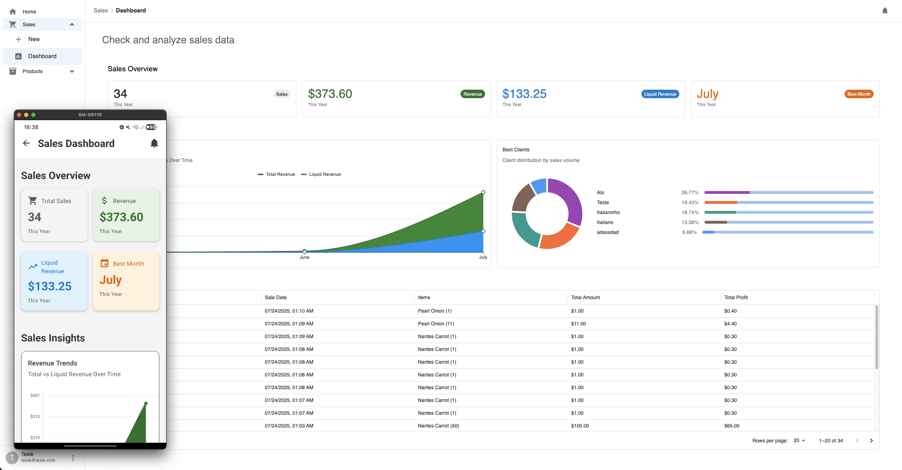
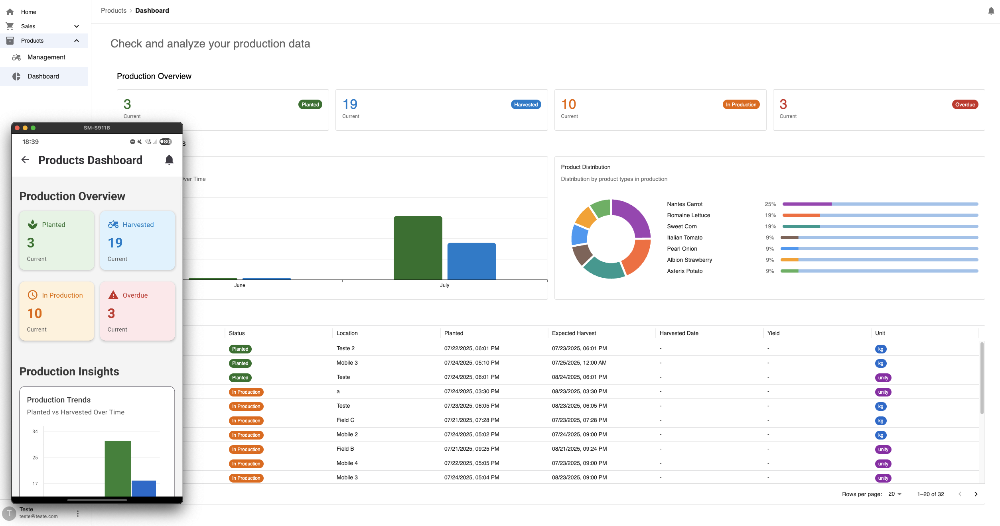
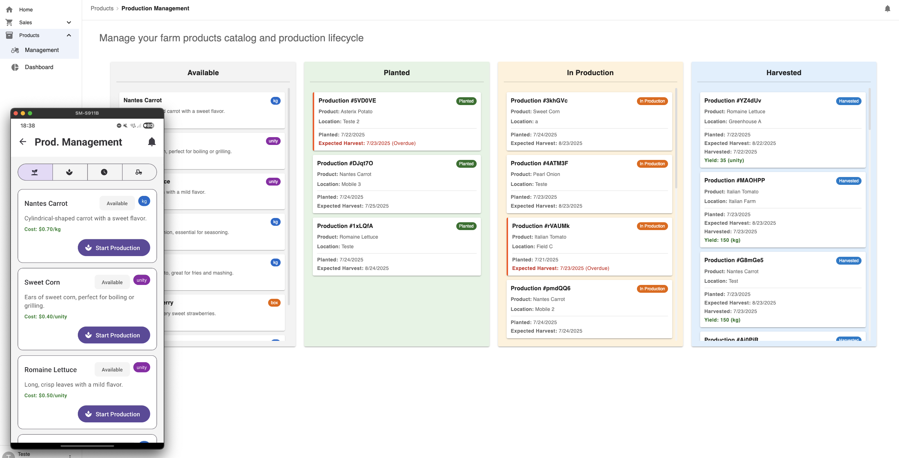
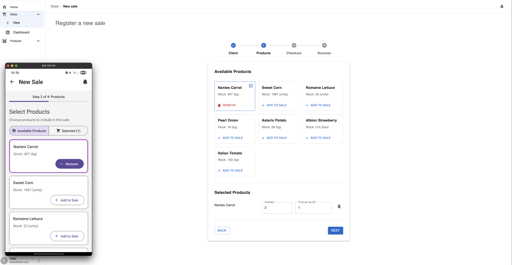

# FIAP Farms - Cooperativa Inteligente

**Tech Challenge Final - Pós-Graduação em Front-End Engineering**

Este projeto foi desenvolvido como a entrega final para o Hackathon da Pós-Graduação FIAP. A solução visa fornecer aos integrantes da cooperativa FIAP Farms uma visão estratégica de suas vendas e um planejamento assertivo das culturas com maior lucratividade, através de uma aplicação cross-platform (Web e Mobile).

## Resumo

A plataforma FIAP Farms é uma solução completa para gestão de cooperativas agrícolas, oferecendo dashboards inteligentes de vendas e produção, controle de ciclo de vida de produção, sistema de metas e alertas, tudo isso em uma arquitetura robusta e escalável que funciona tanto na web quanto em dispositivos móveis.

## Seções

- [Resumo](#resumo)
- [Demonstração da Aplicação](#demonstração-da-aplicação)
- [Features Principais](#features-principais)
- [Estrutura do Projeto](#estrutura-do-projeto)
- [Arquitetura do Projeto](#arquitetura-do-projeto)
  - [Visão Geral da Arquitetura](#visão-geral-da-arquitetura)
  - [Microfrontends com Module Federation](#microfrontends-com-module-federation)
  - [Clean Architecture no Core](#clean-architecture-no-core)
  - [Gerenciamento de Estado Global](#gerenciamento-de-estado-global)
  - [Estratégia Cross-Platform](#estratégia-cross-platform)
  - [Backend e Automações com Firebase](#backend-e-automações-com-firebase)
- [Stack Tecnológica](#stack-tecnológica)
- [Como Executar](#como-executar)
  - [Pré-requisitos](#pré-requisitos)
  - [Configuração do Ambiente de Desenvolvimento](#configuração-do-ambiente-de-desenvolvimento)
- [Conceitos Aplicados](#conceitos-aplicados)

## Demonstração da Aplicação

### Dashboard de Vendas



### Dashboard de Produção



### Gestão de Produção (Kanban)



### Formulário de Nova Venda



## Features Principais

- **Dashboard de Vendas**: Visualização em tempo real dos produtos com maior lucratividade e dados de venda
- **Dashboard de Produção**: Visualização em tempo real dos dados de produção
- **Controle de Produção**: Quadro Kanban para acompanhar e gerenciar o ciclo de vida da produção (que afeta o inventário)
- **Controle de Vendas**: Formulários para registrar novas vendas (que consomem o inventário)
- **Sistema de Metas e Alertas**: Sistema de alertas que notifica o usuário na UI quando metas de produção ou vendas são atingidas
- **Autenticação**: Sistema completo de autenticação de usuários para proteger os dados de cada cooperado
- **Cross-Platform**: Aplicação web responsiva e aplicativo móvel nativo com React Native

## Estrutura do Projeto

```
fiap-farms-hackathon/
├── apps/                           # Aplicações
│   ├── web-shell/                    # Container app (Next.js)
│   │   ├── pages/                      # Páginas e roteamento
│   │   ├── components/                 # Componentes específicos do shell
│   │   └── hooks/                      # Hooks de navegação e breadcrumbs
│   ├── web-sales/                    # Microfrontend de vendas (Next.js)
│   │   ├── pages/                      # Dashboard e formulário de vendas
│   │   ├── hooks/                      # useSalesManagement, useSalesDashboard
│   │   └── utils/                      # Transformers específicos de vendas
│   ├── web-products/                 # Microfrontend de produção (Next.js)
│   │   ├── pages/                      # Dashboard e gestão de produção
│   │   ├── hooks/                      # useProductionManagement, useProductionDashboard
│   │   └── utils/                      # Transformers específicos de produção
│   └── mobile/                       # App React Native
│       ├── app/                        # Estrutura do Expo Router
│       ├── components/                 # Componentes mobile (Paper)
│       ├── hooks/                      # Hooks mobile
│       └── utils/                      # Transformers mobile
├── packages/                       # Packages compartilhados
│   ├── core/                         # Clean Architecture - Lógica de negócio
│   │   ├── src/domain/                 # Entidades e interfaces de repositórios
│   │   ├── src/application/            # Casos de uso
│   │   └── src/infrastructure/         # Implementações Firestore
│   ├── shared-stores/                # Estado global (Zustand)
│   │   ├── src/stores/                 # Auth, goals, notifications
│   │   └── src/hooks/                  # Hooks para consumir as stores
│   ├── web-ui/                       # Biblioteca de componentes web (MUI)
│   │   └── src/components/             # Componentes web reutilizáveis
│   ├── firebase/                     # Configuração do Firebase
│   │   └── src/                        # Configuração client Firebase
│   ├── functions/                    # Firebase Cloud Functions
│   │   └── src/                        # Funções serverless
│   └── typescript-config/            # Configurações TypeScript compartilhadas
└── turbo.json                      # Configuração do Turborepo
```

## Arquitetura do Projeto

### Visão Geral da Arquitetura

A arquitetura deste projeto foi cuidadosamente planejada para ser robusta, escalável, testável e, ao mesmo tempo, pragmática para o escopo de um hackathon. A solução segue princípios modernos de desenvolvimento de software com foco em separação de responsabilidades e reutilização de código.

```
┌─────────────────────────────────────────────────────────┐
│                      APPLICATIONS                       │
├─────────────────┬─────────────────┬─────────────────────┤
│   Web Shell     │  Sales Module   │  Products Module    │
│ (Container App) │ (Microfrontend) │  (Microfrontend)    │
│   Port: 3000    │   Port: 4000    │    Port: 5000       │
├─────────────────┴─────────────────┴─────────────────────┤
│              Mobile App (React Native)                  │
└─────────────────────────────────────────────────────────┘
                              │
┌─────────────────────────────────────────────────────────┐
│                       PACKAGES                          │
├─────────────────┬─────────────────┬─────────────────────┤
│   @core         │ @shared-stores  │     @web-ui         │
│ (Clean Arch)    │   (Zustand)     │  (MUI Components)   │
├─────────────────┼─────────────────┼─────────────────────┤
│   @firebase     │ @typescript-    │                     │
│ (Configuration) │    config       │                     │
└─────────────────┴─────────────────┴─────────────────────┘
                              │
┌─────────────────────────────────────────────────────────┐
│                   FIREBASE BACKEND                      │
├─────────────────┬─────────────────┬─────────────────────┤
│ Authentication  │    Firestore    │  Cloud Functions    │
│                 │   (Database)    │   (Automations)     │
└─────────────────┴─────────────────┴─────────────────────┘
```

### Microfrontends com Module Federation

A aplicação web foi construída seguindo uma arquitetura de **Microfrontends**, composta por três aplicações Next.js independentes:

- **`apps/web-shell`**: A aplicação "container" ou "shell", responsável pelo layout principal, navegação, notificações e autenticação
- **`apps/web-sales`**: Microfrontend focado no dashboard e formulários de vendas
- **`apps/web-products`**: Microfrontend focado no dashboard e controle de produção

Essas aplicações fazem o expose de seus entrypoints e o shell as renderiza sob demanda.
Todas as aplicações compartilham instancias de seus pacotes compartilhados como `@fiap-farms/core`, `@fiap-farms/shared-stores`, `@fiap-farms/web-ui`, `@fiap-farms/firebase` e funcionam também de forma independente.

### Clean Architecture no Core

O pacote `@fiap-farms/core` implementa os princípios da **Clean Architecture** para manter a separação de responsabilidades e garantir que as regras de negócio sejam independentes de frameworks e ferramentas externas.

#### Estrutura das Camadas

```
packages/core/src/
├── domain/                # Lógica de negócio pura (sem dependências externas)
│   ├── entities/           # Entidades de negócio (Product, Sale, Production, etc.)
│   └── repositories/       # Interfaces dos repositórios (contratos)
├── application/           # Regras de negócio da aplicação
│   └── use-cases/          # Casos de uso orquestrando lógica de domínio
└── infrastructure/        # Preocupações externas (bancos, APIs)
    └── repositories/       # Implementações concretas (Firestore)
        └── firestore/      # Implementações específicas do Firestore
```

#### Regra de Dependência

As dependências apontam apenas para dentro, seguindo o princípio da Clean Architecture:

```
Infrastructure → Application → Domain
```

- **Infrastructure** pode importar de Application e Domain
- **Application** pode importar apenas de Domain
- **Domain** não importa nada de outras camadas (lógica de negócio pura)

#### Entidades de Domínio

- **Product**: Um produto da cooperativa.
- **InventoryItem**: Um item de inventário da cooperativa.
- **ProductionItem**: Um item de produção da cooperativa.
- **ProductionStatus**: Status possíveis de um item de produção da cooperativa.
- **Sale**: Uma venda da cooperativa.
- **SaleItem**: Um item de uma venda da cooperativa.

#### Casos de Uso Implementados

**Gestão de Produtos**

- `GetProductsUseCase` - Obter listagem de produtos

**Gestão de Inventário**

- `GetInventoryOverviewUseCase` - Obter status atual do inventário

**Gestão de Produção**

- `StartNewProductionUseCase` - Criar novos itens de produção
- `UpdateProductionStatusUseCase` - Atualizar status de produção de um item
- `GetProductionOverviewUseCase` - Obter dados gerais de produção atuais
- `GetSalesDashboardDataUseCase` - Obter dados do dashboard de produção

**Gestão de Vendas**

- `RegisterSaleUseCase` - Registrar novas vendas
- `GetSalesDashboardDataUseCase` - Obter dados do dashboard de vendas

#### Exemplo de Uso

```typescript
// Iniciando uma nova produção
const productionRepo = new FirestoreProductionRepository(db);
const useCase = new StartNewProductionUseCase(productionRepo);

const newProduction = await useCase.execute({
  productId: 'product-123',
  ownerId: 'user-456',
  location: 'Campo A',
  expectedHarvestDate: new Date('2024-12-01'),
});
```

### Gerenciamento de Estado Global

Para o gerenciamento de estado global, foi escolhido o **Zustand** em vez da Context API por sua simplicidade, performance superior (evitando re-renders desnecessários) e ausência de boilerplate.

#### Stores Implementadas

- **`useAuthStore`**: Gerencia o estado de autenticação
- **`useSalesGoal`**: Gerencia metas de vendas e notificações de conquista
- **`useProductionGoal`**: Gerencia metas de produção e notificações de conquista
- **`useNotificationReadState`**: Gerencia estado de leitura das notificações

#### Padrão "Orchestrator Hook"

Foi criado um padrão único através dos hooks listeners que orquestra o ciclo de vida de todos os listeners da aplicação:

```typescript
// No root da aplicação
function App() {
  useAuthListener();           // Listener de autenticação
  useProductionGoalListener(); // Listener de metas de produção
  useSalesGoalListener();      // Listener de metas de vendas

  return <YourAppContent />;
}
```

Este padrão garante que todos os listeners sejam ativados no login e desativados no logout de forma atômica, eliminando race conditions.

### Estratégia Cross-Platform

#### Consistência

##### Visual

Tanto as aplicações web quanto a aplicação mobile foram construídas com componentes baseados no Material Design da Google (MUI x Native Paper).

Além disso, a mesma nomenclatura e estrutura visual foi utilizada na construção de componentes, calls to action, ícones, cores, linguagem e demais blocos que formam a identidade das aplicações.

##### Formulários

As aplicações web e mobile utilizam o React Hook Form para padronizar a abordagem de validação de formulários.

##### Datas

Todas as aplicações utilizam o DayJS e APIs nativas como `toLocaleString` para padronizar as tratativas de apresentação e formatação de datas.

#### Reutilização de Código

- **`@fiap-farms/core`**: Lógica de negócio compartilhada entre web e mobile
- **`@fiap-farms/shared-stores`**: Estado global consumido por ambas as plataformas
  - Persistência automática de dados salvos pela store: `localStorage` na web e `AsyncStorage` no React Native
- **`@fiap-farms/firebase`**: Configuração do Firebase para ambas as plataformas
  - Configuração unificada de autenticação com persistência cross-platform (`localStorage` x `AsyncStorage`)

#### Separação de Responsabilidades

O projeto segue uma clara separação entre **UI concerns** e **view concerns**:

- **UI Components**: Componentes puros focados apenas na apresentação visual
- **View Logic**: Hooks customizados que gerenciam estado, efeitos colaterais e lógica de apresentação
- **Business Logic**: Casos de uso na camada core que são agnósticos de interface
- **Transformers como View Models**: Utilizamos transformers para converter dados da camada de domínio para formatos adequados à apresentação, atuando como view models que adaptam as entidades de negócio para as necessidades específicas da UI

### Backend e Automações com Firebase

A plataforma **Firebase** foi utilizada como BaaS (Backend as a Service):

#### Firebase Authentication

Sistema completo de autenticação com persistência automática entre sessões.

#### Firestore

Banco de dados NoSQL em tempo real com as seguintes coleções:

- `products` - Catálogo global de produtos
- `production_items` - Itens em produção por usuário
- `inventory` - Inventário agregado por usuário
- `sales` - Histórico de vendas por usuário
- `goals` - Metas configuradas globalmente

A base de dados foi modelada seguindo práticas de desnormalização para otimizar a performance de leitura, com um fluxo de dados causal: **Produção → Inventário → Vendas**.

##### Estrutura das Collections

```javascript
// products - Catálogo global de produtos
{
  _id: "product_id",
  name: "Tomate",
  description: "Tomate orgânico",
  unit: "kg",
  costPerUnit: 5.50
}

// production_items - Itens em produção (por usuário)
{
  _id: "production_id",
  productId: "product_id",
  ownerId: "user_id",
  status: "planted|in_production|harvested",
  plantedDate: "2024-01-15",
  expectedHarvestDate: "2024-04-15",
  harvestedDate: "2024-04-10", // opcional
  yield: 150, // kg colhidos
  location: "Campo A",
  updatedAt: "2024-04-10"
}

// inventory - Estoque disponível (por usuário, atualizado por Cloud Functions)
{
  _id: "inventory_id",
  ownerId: "user_id",
  productId: "product_id",
  productName: "Tomate",
  quantity: 150,
  unit: "kg",
  updatedAt: "2024-04-10"
}

// sales - Histórico de vendas (por usuário)
{
  _id: "sale_id",
  ownerId: "user_id",
  saleDate: "2024-04-12",
  items: [
    {
      productId: "product_id",
      productName: "Tomate",
      quantity: 50,
      pricePerUnit: 8.50,
      totalProfit: 150.00 // calculado por Cloud Function
    }
  ],
  totalSaleAmount: 425.00,
  totalSaleProfit: 150.00, // calculado por Cloud Function
  client: "Restaurante ABC"
}

// goals - Metas globais configuradas
{
  _id: "goal_id",
  type: "sales|production",
  targetValue: 10000,
  currentValue: 8500, // atualizado em tempo real
  period: "monthly",
  isActive: true
}
```

##### Fluxo de Dados

1. **Produção**: Agricultor planta → `production_items` status `planted`
2. **Colheita**: Status muda para `harvested` → Cloud Function incrementa `inventory`
3. **Venda**: Venda registrada → Cloud Function decrementa `inventory` e calcula lucro
4. **Metas**: Listeners monitoram vendas/produção em tempo real para notificações

#### Cloud Functions

Funções serverless para lógicas críticas e seguras:

**Cálculo de Lucro**

```typescript
// Acionada onCreate de uma nova venda
exports.calculateSaleProfit = functions.firestore
  .document('sales/{saleId}')
  .onCreate(async (snap, context) => {
    // Busca custo do produto e "carimba" o lucro no documento
    // Garante integridade histórica e segurança dos dados de custo
  });
```

**Atualização de Inventário**

```typescript
// Incrementa estoque quando produção é colhida
exports.incrementInventory = functions.firestore
  .document('production_items/{itemId}')
  .onUpdate(async (change, context) => {
    // Detecta mudança para status "harvested"
    // Incrementa inventory baseado no yield
  });

// Decrementa estoque quando venda é realizada
exports.decrementInventory = functions.firestore
  .document('sales/{saleId}')
  .onCreate(async (snap, context) => {
    // Decrementa quantities do inventory baseado nos itens vendidos
  });
```

## Stack Tecnológica

### Frontend

- **[Next.js](https://nextjs.org/)**: Meta-framework React para aplicações web
- **[React Native](https://reactnative.dev/)**: Framework para desenvolvimento mobile nativo
- **[TypeScript](https://www.typescriptlang.org/)**: Superset JavaScript com tipagem estática
- **[Material-UI (MUI)](https://mui.com/)**: Biblioteca de componentes web seguindo Material Design
  - **[MUI X Charts](https://mui.com/x/react-charts/)**: Componentes de gráficos avançados
  - **[MUI X Data Grid](https://mui.com/x/react-data-grid/)**: Tabelas e grids de dados complexos
  - **[React Hook Form MUI](https://www.npmjs.com/package/react-hook-form-mui)**: Wrapper para integração do React Hook Form com MUI
- **[React Native Paper](https://reactnativepaper.com/)**: Biblioteca de componentes mobile Material Design
- **[React Native Gifted Charts](https://github.com/Abhinandan-Kushwaha/react-native-gifted-charts)**: Biblioteca de gráficos otimizada para React Native
- **[Zustand](https://zustand-demo.pmnd.rs/)**: Gerenciamento de estado global leve e performático
- **[React Hook Form](https://react-hook-form.com/)**: Biblioteca para formulários performáticos
- **[DayJS](https://day.js.org/)**: Biblioteca leve para manipulação de datas

### Arquitetura e Build

- **[Turborepo](https://turbo.build/)**: Ferramenta de build para monorepos com cache inteligente
- **[Module Federation](https://module-federation.io/)**: Arquitetura de microfrontends com Webpack
- **[Expo](https://expo.dev/)**: Plataforma para desenvolvimento React Native

### Backend e Infraestrutura

- **[Firebase](https://firebase.google.com/)**: Plataforma BaaS completa
  - **Authentication**: Autenticação de usuários
  - **Firestore**: Banco NoSQL em tempo real
  - **Cloud Functions**: Funções serverless
- [Github Actions](https://github.com/features/actions): Para criar workflows de CI

### Desenvolvimento e Qualidade

- **[ESLint](https://eslint.org/)**: Linter para qualidade de código
- **[Prettier](https://prettier.io/)**: Formatador de código automático
- **[TypeScript Config](https://www.typescriptlang.org/docs/handbook/tsconfig-json.html)**: Configurações TypeScript compartilhadas
  - **`base.json`**: Configuração base para todos os projetos
  - **`nextjs.json`**: Configurações específicas para Next.js
  - **`react-library.json`**: Configurações para bibliotecas React

## Como Executar

### Pré-requisitos

1. **Node.js**: Versão LTS (22.x) - [Download](https://nodejs.org/en)
   - Recomendamos o uso do [nvm](https://github.com/nvm-sh/nvm) para gerenciar versões
   - Se usando nvm: `nvm use` (e `nvm install` se necessário)

2. **Para desenvolvimento Mobile**:
   - **Emulador Android/iOS** configurado ou **dispositivo físico** conectado
   - **Recomendação**: [scrcpy](https://github.com/Genymobile/scrcpy) para espelhar tela Android no computador
   ```bash
   # Instalar scrcpy (macOS)
   brew install scrcpy
   ```

### Configuração do Ambiente de Desenvolvimento

#### 1. Instalação das Dependências

```bash
# Clone o repositório
git clone git@github.com:K-Schaeffer/fiap-farms-hackathon.git
cd fiap-farms-hackathon

# Sete a versão node do projeto
nvm use

# Instale as dependências (executar na raiz)
npm install
```

#### 2. Comandos de Execução

**Executar todas as aplicações:**

```bash
npm run dev
```

Isso iniciará todas as aplicações simultaneamente:

- **Web Shell** (Container): `http://localhost:3000`
- **Web Sales** (Microfrontend): `http://localhost:4000`
- **Web Products** (Microfrontend): `http://localhost:5000`
- **Mobile App**: Expo Metro Bundler para desenvolvimento
- **Packages**: Build automático em watch mode de todas as bibliotecas (`@fiap-farms/core`, `@fiap-farms/shared-stores`, `@fiap-farms/web-ui`, etc.)

**Executar apenas aplicações web:**

```bash
npm run dev:web
```

**Executar apenas mobile:**

```bash
npm run dev:mobile
```

**Executar Cloud Functions (desenvolvimento):**

```bash
npm run dev:functions
```

#### 3. Scripts Úteis

**Build para produção:**

```bash
npm run build
```

**Limpeza completa:**

```bash
npm run clean
```

**Formatação de código:**

```bash
npm run format
```

**Verificação de lint:**

```bash
npm run lint
```

**Deploy das Cloud Functions:**

```bash
npm run deploy:functions
```

## Conceitos Aplicados

### Arquiteturais

- **[Clean Architecture](https://blog.cleancoder.com/uncle-bob/2012/08/13/the-clean-architecture.html)**: Separação clara de responsabilidades em camadas bem definidas
- **[Microfrontends](https://micro-frontends.org/)**: Arquitetura distribuída para aplicações frontend
- **[Monorepo](https://monorepo.tools/)**: Gerenciamento centralizado de múltiplos projetos relacionados
- **[Cross-Platform Development](https://en.wikipedia.org/wiki/Cross-platform_software)**: Compartilhamento de código entre web e mobile

### Design e UX

- **[Material Design](https://m3.material.io/)**: Guidelines de design consistentes
- **[Responsive Design](https://web.dev/responsive-web-design-basics/)**: Adaptação para diferentes tamanhos de tela

### Desenvolvimento

- **[Domain-Driven Design (DDD)](https://martinfowler.com/bliki/DomainDrivenDesign.html)**: Modelagem focada no domínio do negócio
- **[Dependency Injection](https://martinfowler.com/articles/injection.html)**: Inversão de controle para testabilidade
- **[Repository Pattern](https://martinfowler.com/eaaCatalog/repository.html)**: Abstração da camada de dados
- **[Use Case Pattern](https://blog.cleancoder.com/uncle-bob/2012/08/13/the-clean-architecture.html)**: Orquestração de regras de negócio

### Otimizações de Performance

- **Lazy Loading**: Microfrontends carregados sob demanda via Module Federation
- **Code Splitting**: Chunks automáticos gerados pelo Next.js
- **Build Caching**: Cache inteligente do Turborepo para builds incrementais
- **State Memoization**: Zustand evita re-renders desnecessários
- **Database Optimizations**: Queries Firestore com índices otimizados para performance

---
